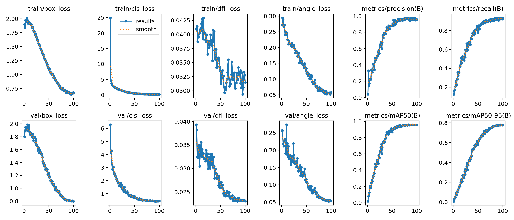
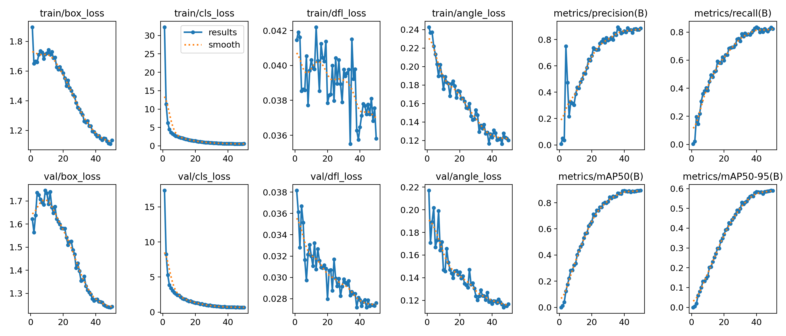
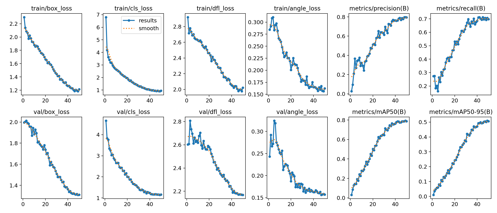

The detection task (product track) was chosen as the topic for this project, specifically the identification of fractures on X-ray images.

# Tools

`YOLO` models and `ultralytics` framework are used to solve the task. A quick search showed that similar detection tasks are quite successfully solved by `YOLOv8` models with a `ResNet50` backbone. Further it was decided to use more modern versions of `YOLO`, specifically `yolo26`. Furthermore, it is difficult to overestimate the convenience of using `ultralytics` for model fine-tuning. It is an up-to-date, well-supported framework with plenty of options for model customization, hyperparameter and augmentation tuning, and it includes many handy utilities for working with datasets and inference.

`streamlit` was chosen as both the frontend and backend for the application. From the first glance, it became clear that this is an extremely convenient tool for prototyping applications. The rapid deployment capabilities provided by `streamlit.io` are also highly important.

# Dataset

A small [python script](inspect_dataset.py) was written to investigate the dataset. First and foremost, it was important to check if there was class imbalance in the dataset critical enough to affect training. Additionally, the script allows looking at any image in the dataset with overlaid bboxes.


```
===========================================================================
Class Name                | Train    | Val      | Test     | Total   
---------------------------------------------------------------------------
elbow positive            | 339      | 29       | 17       | 385     
fingers positive          | 531      | 48       | 27       | 606     
forearm fracture          | 316      | 43       | 14       | 373     
humerus fracture          | 3        | 0        | 0        | 3       
humerus                   | 311      | 36       | 15       | 362     
shoulder fracture         | 360      | 20       | 17       | 397     
wrist positive            | 228      | 28       | 6        | 262     
---------------------------------------------------------------------------
TOTAL                     | 2088     | 204      | 96       | 2388    
===========================================================================
```

The analysis revealed that the dataset contains only a few images for the `humerus fracture` class. Furthermore, a closer examination showed that the classes `humerus fracture` and `humerus` were mixed up. It was decided to retrieve the original version of this dataset from [`roboflow`](https://universe.roboflow.com/bone-frac-dataset/bone-frac-dataset) — perhaps some images were lost during conversion, or there is a newer version with more images. The dataset was converted to the YOLO format using `ultralytics`:

```python
from ultralytics.data.converter import convert_coco

convert_coco(
    labels_dir="BoneFractureCoco",
    save_dir="BoneFractureYoloOBB",
    use_segments=True
)
```

In the new version, there were significantly more images for all classes, but `humerus` was still poorly represented. In the end, it was decided to use the newer version of the dataset but exclude the `humerus` class. Firstly, a few images are not enough for any effective training, and secondly, this task is primarily associated with detecting bone damages, whereas the `humerus` class represents the detection of the humerus bone itself.

```
===========================================================================
Class Name                | Train    | Val      | Test     | Total   
---------------------------------------------------------------------------
elbow positive            | 469      | 144      | 68       | 681     
fingers positive          | 772      | 191      | 107      | 1070    
forearm fracture          | 442      | 138      | 70       | 650     
humerus fracture          | 444      | 152      | 58       | 654     
shoulder fracture         | 511      | 130      | 67       | 708     
wrist positive            | 343      | 83       | 46       | 472     
---------------------------------------------------------------------------
TOTAL                     | 2981     | 838      | 416      | 4235    
===========================================================================
```

# Training

Training was performed on `kaggle`. The chosen models were `yolo26s-obb` (100 epochs), `yolo26n-obb` (50 epochs), and `yolov8n-obb` (50 epochs). All models are `OBB` (Oriented Bounding Box) versions because the source dataset contains polygons calculated based on segmentation masks, and oriented `bbox` allows better maximization of `IoU`.

The following considerations were taken into account:

* The default augmentations include Blur, which is not very useful for X-ray analysis where fine details need to be examined. It is better to eliminate it.
* The weight of `CLAHE` should be increased, as it highlights the fine details needed by the model.
* Mosaic augmentation should be disabled, as composing collages does not help the model learn the characteristics of a specific type of fracture.
* Other augmentations were slightly adjusted based on general reasoning.

**Training Results**

| model | epochs | mAP50 | mAP50-95 |
| --- | --- | --- | --- |
| `yolo26s-obb` | 100 | 0.946 | 0.773 |
| `yolo26n-obb` | 50 | 0.885 | 0.584 |
| `yolov8n-obb` | 50 | 0.814 | 0.522 |

**Charts**

**`yolo26s-obb`**



**`yolo26n-obb`**



**`yolov8n-obb`**



Other training artifacts are also available in the folder corresponding to each model.

The smaller number of epochs for smaller models was chosen because the most significant progress in training `yolo26s-obb` was shown precisely in the first 50 epochs. Although in general, the number of epochs could have been increased to 150-200, perhaps a qualitative leap would have occurred at one of the later stages. Also, a larger number of epochs might have improved the `mAP50-95` metric.

# Inference

The application is available at: [https://bonedetectionyolo.streamlit.app](https://www.google.com/search?q=https://bonedetectionyolo.streamlit.app)

The application provides:

* Selection of a pretrained model.
* Uploading one or multiple images and detecting fractures on them. For each result, the inference speed of the model is reported.
* Specifying `Confidence Threshold` and `IoU Threshold`.
* A demo mode where the selected model runs on pre-loaded images — one for each class. In this mode, not only the detection result but also the `ground truth` from the dataset for the given image will be displayed.

# Conclusions

* The models trained reasonably well.
* As expected, the best results are shown by the model with more parameters trained for a higher number of epochs.
* Models with fewer parameters are expectedly faster, while maintaining acceptable detection quality.
* The weak point is the exclusion of a class from the dataset; it would have been better to find more images of the humerus bone and add them to the training set.
